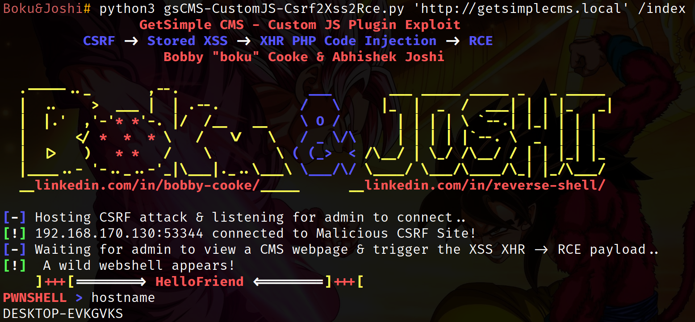

## GetSimple CMS Custom JS v0.1 - CSRF to Stored XSS to RCE
##### Exploit Author: Bobby Cooke (boku) & Abhishek Joshi

##### Vulnerability Description:
+ The Custom JS v0.1 plugin for GetSimple CMS suffers from a Cross-Site Request Forgery (CSRF) attack that allows remote unauthenticated attackers to inject arbitrary client-side code into authenticated administrators browsers, which results in Remote Code Execution (RCE) on the hosting server, when an authenticated administrator visits a malicious third party website.

##### Vulnerability Statistics
+ CVSS Base Score: 9.6
+ CVSS v3.1 Vector: AV:N/AC:L/PR:N/UI:R/S:C/C:H/I:H/A:H

